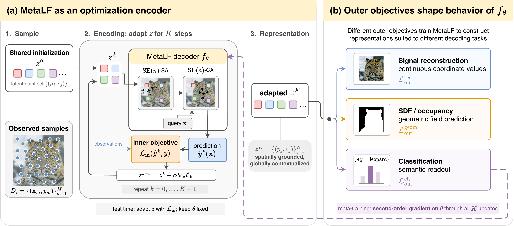
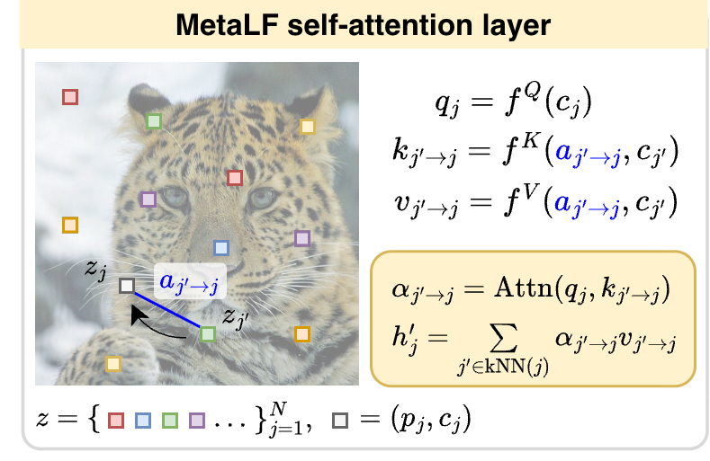

# Meta-Learned Attentive Latent Fields

### Optimization Encoders: Rethinking Second-Order Meta-Learning for Neural Fields

Meta-learned attentive latent fields encode a signal by adapting the poses and content
of a latent pointcloud over a few reconstruction steps. We meta-learn this process end
to end, so gradients from the outer task objective flow through every inner update and
shape the representation it produces. Reconstruction updates can therefore form an encoder
for tasks such as classification or segmentation, without requiring the inner and
outer losses to match.



Self-attention lets latent tokens share information, while coordinate queries decode the
continuous signal. Attention uses relative geometry, so moving the tokens moves the
represented field. At test time, the decoder stays fixed and only the tokens adapt.

<p align="center">
  
</p>

[Installation](#installation) · [Examples](#examples)
· [Experiment with attentive latent fields](#experiment-with-attentive-latent-fields)
· [Pretrained models](#pretrained-models)

## Installation

Use Python 3.11 to 3.13. From this directory:

```bash
python -m venv .venv
source .venv/bin/activate
pip install torch==2.6.0 torchvision==0.21.0 --index-url https://download.pytorch.org/whl/cpu
pip install -e '.[cuda,test]'
```

For CPU execution, install `'.[test]'` instead. Use a GPU for the full training recipes.

## Examples

### Meta-reconstruction on CIFAR-10

Learn to represent images as continuous fields, then reconstruct unseen images by
adapting their latent tokens.

```bash
python meta_reconstruct.py data.download=true data.root=./datasets \
  output_dir=runs/cifar_reconstruct
python meta_reconstruct.py mode=evaluate \
  checkpoint=runs/cifar_reconstruct/best.npz data.root=./datasets \
  output_dir=runs/cifar_reconstruct/evaluation
```

Evaluation saves metrics and example reconstructions in `output_dir`.

### Meta-classification on CIFAR-10

Class labels supervise the outer objective, which trains through the inner
reconstruction updates. At test time, a pooled head classifies the adapted features
using image observations alone.

```bash
python meta_classify.py data.download=true data.root=./datasets \
  output_dir=runs/cifar_classify
python meta_classify.py mode=evaluate \
  checkpoint=runs/cifar_classify/last.npz data.root=./datasets \
  output_dir=runs/cifar_classify/evaluation
```

### Meta-segmentation on Ombria

Predict flood masks from satellite images taken before and after an event.
Flood labels supervise only the outer objective; the inner loop reconstructs the images.
Obtain [Ombria](https://github.com/geodrak/OMBRIA) and keep its original layout:

```text
datasets/OMBRIA/
├── OmbriaS1/{train,test}/{BEFORE,AFTER,MASK}/
└── OmbriaS2/{train,test}/{BEFORE,AFTER,MASK}/
```

```bash
python meta_segment.py data.root=./datasets/OMBRIA output_dir=runs/ombria
python meta_segment.py mode=evaluate \
  checkpoint=runs/ombria/best.npz data.root=./datasets/OMBRIA \
  output_dir=runs/ombria/evaluation
```

Evaluation saves predicted masks alongside the input images and ground truth.

### Meta-reconstruction on polynomial fields

Study how adaptation fits a known family of continuous signals. This small example
runs one training batch and measures reconstruction quality and latent geometry,
without a dataset download:

```bash
python polynomial_fields.py training.epochs=1 training.max_batches=1 \
  data.batch_size=1 data.limit_train=1 data.limit_eval=1 \
  output_dir=runs/polynomial_example
python polynomial_fields.py mode=analyze \
  checkpoint=runs/polynomial_example/best.npz \
  polynomial_evaluation.fields=1 output_dir=runs/polynomial_example/analysis
```

The analysis writes `polynomial_metrics.json` with PSNR, effective rank, and tangent
fraction. Run `python polynomial_fields.py` for the full training recipe.

## Experiment with attentive latent fields

The default attentive latent field has 25 tokens, 64 content channels, and four
self-attention layers. Change the token representation directly from the command line:

```bash
python meta_reconstruct.py model.n_latents=36 model.latent_channels=32
```

Compare attention depths on polynomial fields:

```bash
python polynomial_fields.py -m model.n_self_attn=0,2,4
```

Recipes also cover Functa, SpatialFuncta, and ENF. Select a complete recipe to switch
models with their corresponding settings:

```bash
python meta_reconstruct.py experiment=cifar_reconstruct_enf
python meta_classify.py experiment=cifar_classify_spatial_functa
python meta_segment.py experiment=ombria_enf data.root=./datasets/OMBRIA
```

Hydra composes the YAML files in [configs/](configs/); append `--cfg job --resolve`
to inspect a recipe. Add a YAML in [configs/experiment/](configs/experiment/) for your
own experiment. The [models/](models/) share a common interface, and task trainers
reuse the adaptation loop in [meta_learning/](meta_learning/).

## Pretrained models

The companion checkpoint bundle contains pretrained models for the examples above.
Place its contents in `checkpoints/`, then try an attentive latent field on a few CIFAR-10 images:

```bash
python meta_reconstruct.py mode=evaluate data.download=true data.root=./datasets \
  checkpoint=checkpoints/cifar/reconstruction/attentive_latent_field_r2_s42.npz \
  data.limit_eval=16 output_dir=runs/pretrained
```

Each checkpoint includes its model configuration. Use `checkpoint=...` with the
corresponding entry point to evaluate reconstruction, classification, segmentation,
or polynomial geometry.
